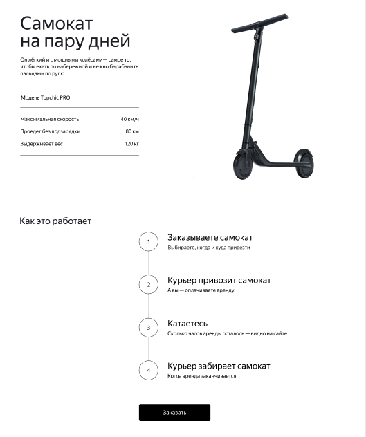
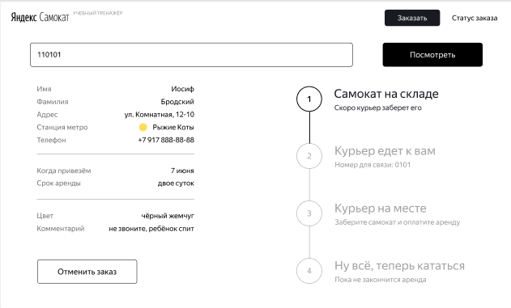
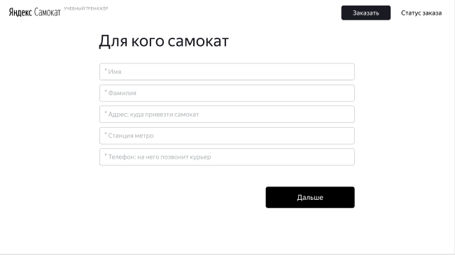
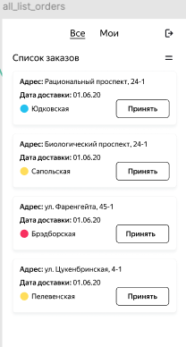
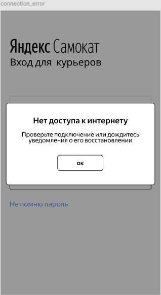
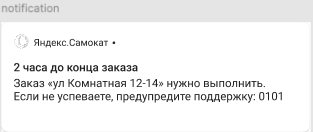
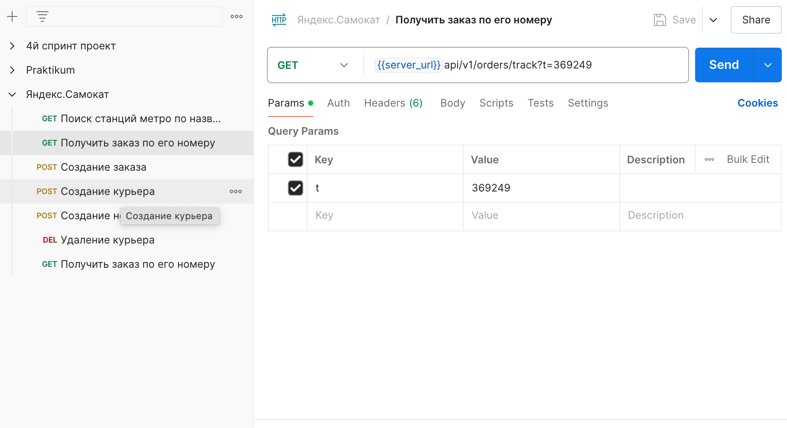

# Дипломный проект: Тестирование Яндекс.Самокат  

## Описание проекта  
Дипломный проект посвящён тестированию сервиса Яндекс.Самокат, веб-приложения для оформления заявки на аренду и отслеживания статуса заказа, мобильного приложения для курьеров сервиса и API, проверки БД. Работа включала анализ требований, проектирование тестов, выполнение тестирования и документирование результатов.  

---

## Основные задачи  
### Задание 1: Веб-приложение Яндекс.Самокат  
- Изучение требований к функциональности приложения.    
- Подготовка тестов валидации полей экрана «Сделать заказ».  
- Проведение тестирования функциональности по чек-листам, таблице валидации и требованиям.  
- Заведение багов, найденных как по тестовой документации, так и вне её.

### Задание 2: Мобильное приложение Яндекс.Самокат  
- Анализ требований к мобильному приложению для курьеров.  
- Проектирование тест-кейсов для нотификаций, уведомлений приходящих, за 2 часа, до дедлайна выполнения заказа, и их верстки. Проектирование тест-кейсов всплывающего окна «Отсутствует интернет-соединение». 
- Проверка верстки по макетам в Figma.  
- Проведение тестирования мобильного приложения и регистрация дефектов.

 

### Задание 3: API Яндекс.Самокат  
- Изучение требований к API в Apidoc.  
- Проектирование чек-листа для тестирования API по требованиям.  
- Проведение тестирования API в Postman и регистрация найденных дефектов.

---

## 📋 Чек-листы и тест-кейсы  
  
- [Чек-лист проверки экрана "Статус заказа"](https://docs.google.com/spreadsheets/d/1200IP1z6ZY4Hk4Yd0XoF4i5fQCu3D9udsESkaac1f30/edit?gid=943703744#gid=943703744)
- [Таблица данных валидации полей экрана «Сделать заказ»](https://docs.google.com/spreadsheets/d/1200IP1z6ZY4Hk4Yd0XoF4i5fQCu3D9udsESkaac1f30/edit?gid=1540465171#gid=1540465171)  
- [Тест-кейсы мобильного приложения для курьеров](https://docs.google.com/spreadsheets/d/1200IP1z6ZY4Hk4Yd0XoF4i5fQCu3D9udsESkaac1f30/edit?gid=424948590#gid=424948590)  
- [Чек-лист тестирования API приложения](https://docs.google.com/spreadsheets/d/1200IP1z6ZY4Hk4Yd0XoF4i5fQCu3D9udsESkaac1f30/edit?gid=336872680#gid=336872680)  

## 🐞 Баг-репорты  
- Все дефекты зарегистрированы в Google Sheets:
  - [Баги](https://docs.google.com/spreadsheets/d/1200IP1z6ZY4Hk4Yd0XoF4i5fQCu3D9udsESkaac1f30/edit?gid=1413524465#gid=1413524465)
  - [Баги API](https://docs.google.com/spreadsheets/d/1200IP1z6ZY4Hk4Yd0XoF4i5fQCu3D9udsESkaac1f30/edit?gid=818524063#gid=818524063)

---

## Инструменты и технологии  

  

---

## Выводы и достижения  
- Спроектированы и выполнены тесты для проверки функциональности веб-приложения, мобильного приложения и API.  
- Обнаружены и зарегистрированы баги с детальной информацией, включая шаги воспроизведения, ожидаемые и фактические результаты.
